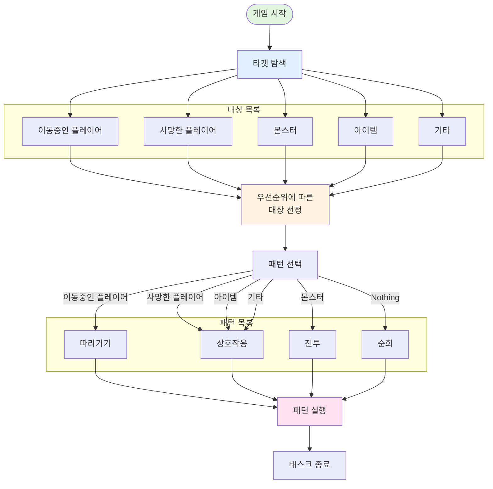

## 개발 사례 - 자동화 봇 AI 스크립트

서버 성능 테스트용 자동화 봇의 행동 패턴 스크립트를 개발했습니다.
타겟 선정과 행동 패턴을 분리하여 확장성을 고려한 방식으로 설계했습니다.

```mermaid
flowchart TD
    Start([게임 시작]) --> FindTarget[타겟 탐색]

    subgraph TargetList[대상 목록]
    MovingPlayer[이동중인 플레이어]
    DeadPlayer[사망한 플레이어]
    Monster[몬스터]
    Item[아이템]
    Etc[기타]
    end    

    FindTarget --> MovingPlayer
    FindTarget --> DeadPlayer
    FindTarget --> Monster
    FindTarget --> Item
    FindTarget --> Etc
    
    MovingPlayer --> SelectActor[우선순위에 따른<br/>대상 선정]
    DeadPlayer --> SelectActor
    Monster --> SelectActor
    Item --> SelectActor
    Etc --> SelectActor
    SelectActor --> TaskType[패턴 선택]

    subgraph PatternList[패턴 목록]
    FollowTask[따라가기]
    CombatTask[전투]
    InteractionTask[상호작용]
    PatrolTask[순회]
    end    
    
    TaskType -->|이동중인 플레이어| FollowTask
    TaskType -->|사망한 플레이어| InteractionTask
    TaskType -->|아이템| InteractionTask
    TaskType -->|기타| InteractionTask
    TaskType -->|몬스터| CombatTask
    TaskType -->|Nothing| PatrolTask
    FollowTask --> ProcessTask[패턴 실행]
    InteractionTask --> ProcessTask
    CombatTask --> ProcessTask
    PatrolTask --> ProcessTask
    
    ProcessTask --> EndTask[태스크 종료]
    
    style Start fill:#e1f5e1
    style FindTarget fill:#e1f0ff
    style SelectActor fill:#fff4e1
    style ProcessTask fill:#ffe1f0
```

### 사용 기술

- TypeScript
