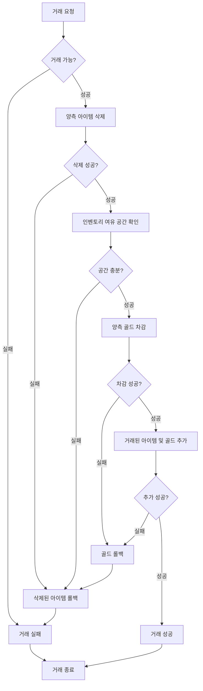

## 개발 사례 - 개인거래

### 개요

유저 간 직접 아이템과 골드를 교환하는 시스템입니다.
거래 과정에서 타이밍 이슈 등으로 아이템 및 골드 복제되거나 유실되지 않도록 보장해야 했습니다.

### 무결성 보장 설계

거래 완료 처리는 아래 순서로 진행되며, 각 단계 실패 시 이전 단계까지 롤백합니다.

**아이템 삭제를 먼저 하는 이유**

아이템 추가 가능 여부(인벤토리 공간)는 삭제 후에야 정확히 확인할 수 있습니다.
삭제 전 공간을 확인하면 교환할 아이템이 차지하던 슬롯을 고려하지 못하기 때문입니다.

### 사용 기술

- C++, MySQL
