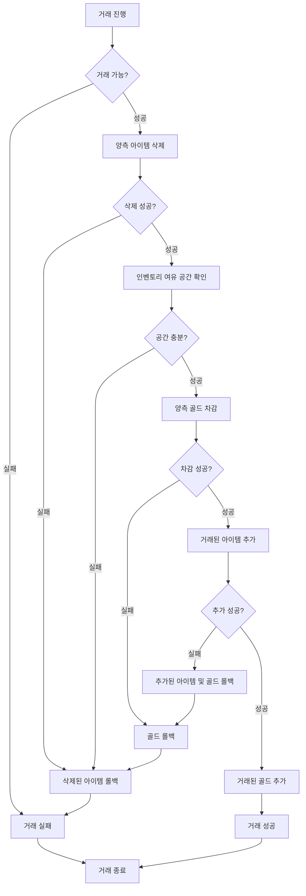

## 개발 사례 - 개인거래

### 개요

유저 간 직접 아이템과 골드를 교환하는 시스템입니다.
거래 과정에서 타이밍 이슈 등으로 아이템 및 골드 복제되거나 유실되지 않도록 보장해야 했습니다.

### 무결성 보장 설계

거래 수락 및 확정 절차 후 실제 거래 진행은 아래 순서로 진행되며, 각 단계 별로 실패시 이전 단계까지 진행한 내용을 롤백하여 무결성을 보장합니다.

**아이템 삭제를 먼저 하는 이유**

아이템 추가 가능 여부(인벤토리 공간)는 삭제 후에야 정확히 확인할 수 있습니다.
삭제 전 공간을 확인하면 교환할 아이템이 차지하던 슬롯을 고려하지 못하기 때문입니다.

**골드 추가 후 예외처리가 없는 이유**

골드 추가는 실패하지 않도록 구현되어 있었습니다. 
만약 추가할 골드를 인벤토리에 추가하지 못한 경우 우편으로 발송 하는 등의 안전장치를 마련해두었습니다.

**거래 진행 로직 pseudo code**

[finish_trade.cpp](./finish_trade.cpp)

### 사용 기술

- C++, MySQL
