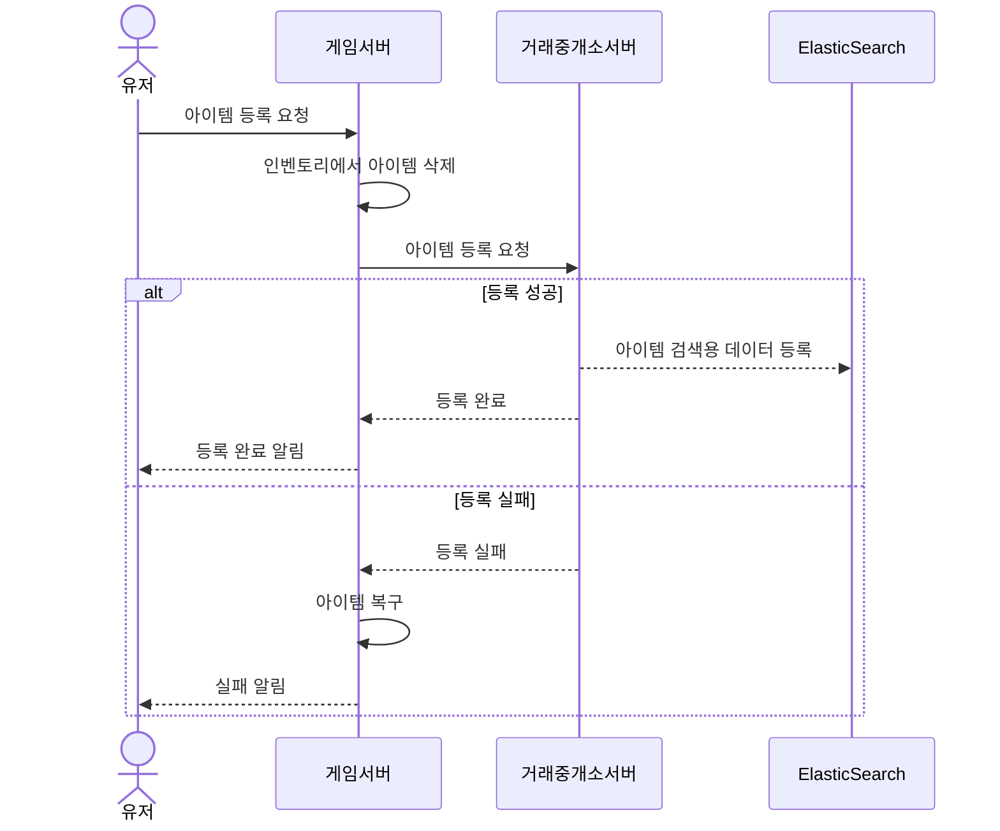

## 개발 사례 - 거래중개소

### 배경

거래중개소에서 발생하는 부하가 게임 플레이에 영향을 주지 않아야하며, 거래 과정 중 아이템이 복제되거나 유실되지 않도록 보장해야 했습니다.

### 설계 결정

거래중개소 전용 서버를 게임 서버와 분리하여 운영하기로 결정했고, 이에 따라 거래중개소용으로 별도의 DB를 사용하게 되었습니다.
이로 인해 DB트랜잭션으로 무결성 처리를 하기 어려워졌고, 대신 아이템 선 삭제 후 실패 시 복구하는 구조를 선택했습니다.

이 방식을 선택한 이유는 아이템의 복제 시 후처리가 아이템 유실 시 후처리보다 힘들다고 판단했기 때문입니다.

### 장애 발생과 대응

거래중개소 서버 장애 발생 시 아이템이 게임 서버에서 삭제된 채로 유실될 가능성이 있습니다. 이 경우 아래와 같이 각 단계별로 로그를 남겨, 실제 유실 여부 확인 및 복구 처리에 활용하였습니다.

- 아이템 삭제 로그
- 거래중개소 등록 요청 로그
- 등록 결과(성공/실패) 로그
- (실패 시)아이템 복구 로그

### 사용 기술

- C++, MySQL, ElasticSearch
